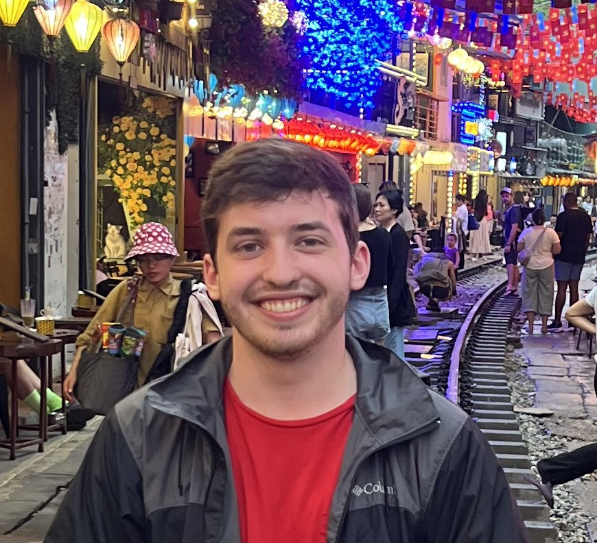
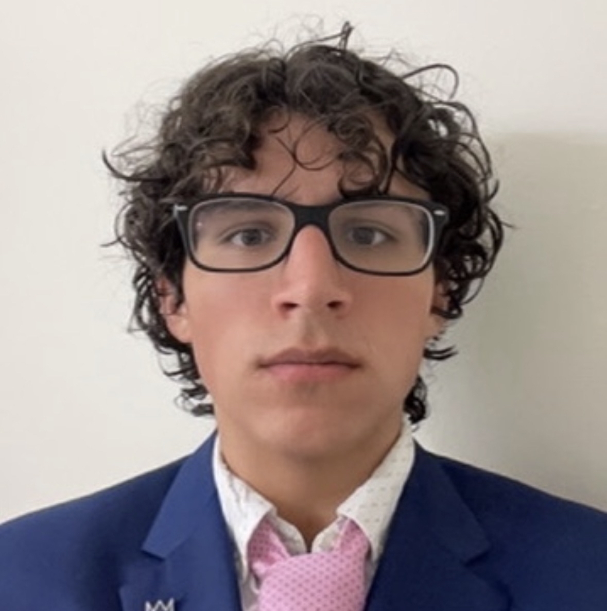

<section class="container mx-auto px-4 py-16">
<h2 class="text-3xl font-bold mb-12 text-gray-900 text-center">Meet the Team</h2>

  <!-- Team Member -->
  

    
    <h3 class="text-xl font-semibold mb-1">Willem Evanson</h3>
    

      Willem is a computer science student at the University of Alabama. His
      interests are in operating system and programming language development.
      He has experience through internships, classes, and research. Willem is
      skilled in Python, C, C++, and Rust. In his free time, He likes to play
      volleyball and read.
    

    

      <a href="mailto:wdevanson@crimson.ua.edu" class="text-blue-600 hover:underline">Email</a>
      <a href="https://github.com/WillemEvanson" class="text-blue-600 hover:underline" target="_blank">GitHub</a>
    

  

  <!-- Team Member -->
  

    
    <h3 class="text-xl font-semibold mb-1">Sam Pope</h3>
    
Sam is a computer science student at the University of Alabama. His interests are in web deveopment and artifical intelegence. He has gained experience through internships, classes, and projects. Sam is skilled in Python, C, C++, and Angular. In his free time Sam likes to read, play ultimate frisbee, and cook.

    

      <a href="mailto:wspope@crimson.ua.edu" class="text-blue-600 hover:underline">Email</a>
      <a href="https://github.com/SamPope11" class="text-blue-600 hover:underline" target="_blank">GitHub</a>
    

  

  <!-- Team Member -->
  

    
    <h3 class="text-xl font-semibold mb-1">Matthew Davis</h3>
    
Matthew is a computer science student at The University of Alabama with a focus primarily in security, and database management. His exeperience comes in the form of just under a decade of of hands on work with older databases, custom scripts, and group organization. In his free time Matthew is working on his own applications for the market, and organizes group events for a variety of side projects.

    

      <a href="mailto:dmdavis9@ua.edu" class="text-blue-600 hover:underline">Email</a>
      <a href="https://github.com/dmdaviddavis" class="text-blue-600 hover:underline" target="_blank">GitHub</a>
    

  

  <!-- Team Member -->
  

    
    <h3 class="text-xl font-semibold mb-1">Walt Wilber</h3>
    
Walt is a computer science student at the University of Alabama who is also pursuing a masters in Business Analytics. From previous research work with UA and LSU School of Medicine, he has experience in neural networks, data analytics, computer vision, and bioinformatics. In his free time Walt likes to go camping, run, and play guitar.

    

      <a href="mailto:wgwilber@crimson.ua.edu" class="text-blue-600 hover:underline">Email</a>
      <a href="https://github.com/WaldWober" class="text-blue-600 hover:underline" target="_blank">GitHub</a>
    

  

  <!-- Team Member -->
  

    
    <h3 class="text-xl font-semibold mb-1">Christian Meraz-Santiago</h3>
    
Christian is a computer science student at the University of Alabama with a minor in robotics. He has gained experience through his various clubs and extracurricular activities. He hopes to pursue a career in datascience and is experienced in Matlab, jupyter notebooks, as well as a variety of coding languages. In his free time he likes to read, skateboard, and code.

    

      <a href="mailto:cjmerazsantiago@crimson.ua.edu" class="text-blue-600 hover:underline">Email</a>
      <a href="https://github.com/cSantiago04" class="text-blue-600 hover:underline" target="_blank">GitHub</a>
    

  

</section>
